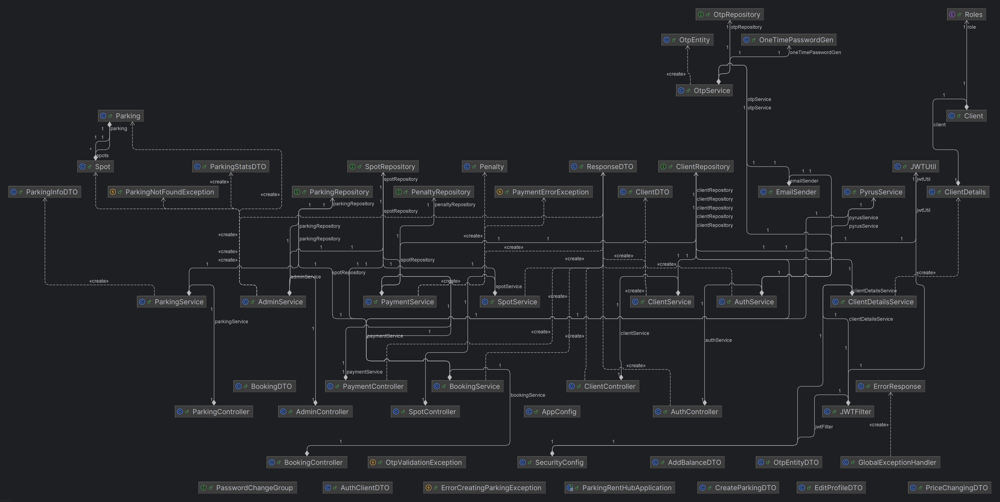

# 🚗 Parking Rent Hub. 
Приложение для бронирования парковочных мест.

**Находится на стадии разработки**.

Использованные техниологии: **Java, Spring Framework (Boot, Web, Data JPA, Security) Hibernate ORM, PostgreSQL, MongoDB, WebClient**

  
<h1 style="font-size: 32px; color: red;">🖼️ Визуальная диаграмма проекта</h2>

  

    
  

## 📋 **Описание реализованного функционала** на 27.03.2025:
  ### 🔐 *Auth Service*
   * JWT-аутентификация;
   * Процесс регистрации и авторизации пользователя;
     
       🔄 Данные пользователя отравляются в CRM Purys для дальнейшего администрирования (исп. WebClient);     
   * Процесс сброса забытого пароля через одноразовый код, отправляемый на электронную почту клиента (исп. Jakarta.Mail).
   * ...
  ### 🏢 *Admin Service*
   * Функционал добавления парковки в приложение;
   * Управление ценовой политикой парковки;
   * Временная заморозка парковки (парковка становится недоступной для новых бронирований);
   * Удаление парковки из приложения при отсутствии активных бронирований;
   * Получение статистики по каждой парковке;
   * ...
  ### 📅 *Booking Service*
   * Возможность бронирования парковочного места:
       * до конца дня;
       * на определенное количество дней;
       * на 30 календарных дней;
   * Функционал освобождения парковочных мест при завершении бронирования И ОТСУТСТВИИ автомобиля на парковочном месте (см. прим.):
     
       ⚠ Примечание: если время аренды истекло, а автомобиль еще стоит на парковке, активируется механизм списания штрафа за просрок с баланса пользователя - см. функционал PaymentService.
   * ...
  ### 💳 *Payment Service*
   * Имитация работы сторонней платежной системы для пополнения денежного баланса пользователя в приложении;
   * Функционал для пополнения денежного баланса;
   * Функционал списания денежных средств с баланса пользователя при осуществлении бронирования;
   * Функционал для списания денежных средств за просрок (см. прим.):
     
      ⚠ Примечание: если время аренды истекла, но автомобиль так и не уехал с парковки, с его денежного баланса один раз в сутки списывается суточная стоимость аренды парковочного места на конкретной парковке.
   * ...
  ### 👤 *Client Service*
   * Функционал отображения профиля пользователя;
   * Функционал для редактирования пользовательских данных (ограничен);
   * Удаление профиля (!) - при отсутствии активных бронирований;
   * Смена пароля для доступа в приложение;
   * ...
  ### 🔧 *Вспомогательное*
   * Формирование списка парковок и отдача их на фронд для дальнейшей реализации процесса бронирования через список парковок (Parking Service);
   * Проверка на занятость парковочного места (Spot Service);
